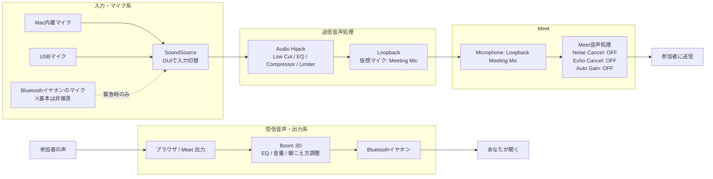
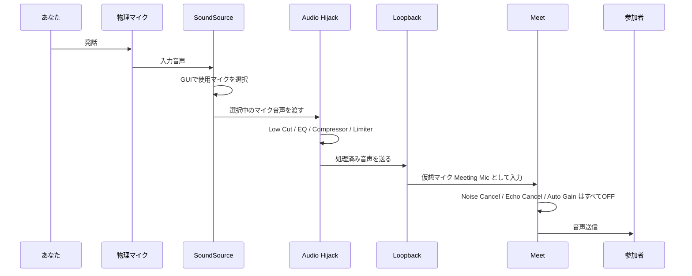
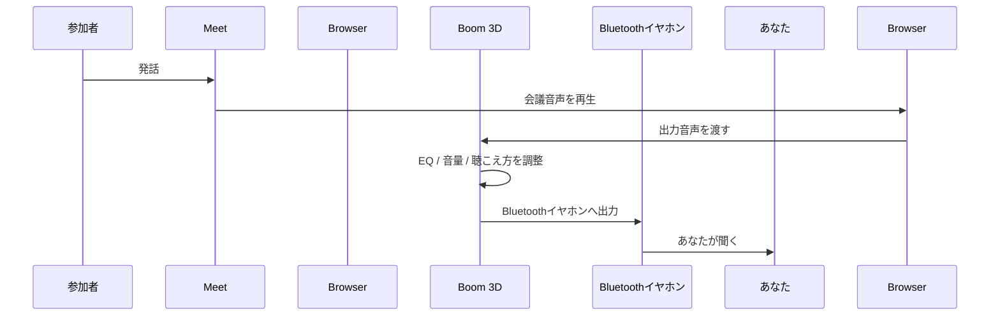
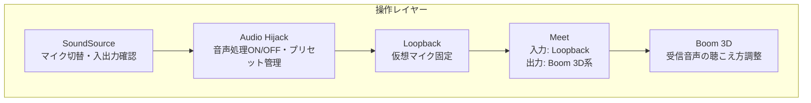

# 音声環境アーキテクチャ・セットアップ手順書

## 1. 目的

Meet 利用時に、以下を実現する。

- Meet 側のノイズキャンセル、エコーキャンセル、自動ゲイン調整は利用しない
- Boom 3D は必ず利用する
- マイク切替を macOS のシステム設定ではなく GUI から行う
- 自分の声は Audio Hijack で整えてから Meet に送る
- 参加者の声は Boom 3D を通して Bluetooth イヤホンで聞く
- Meet 側の設定はなるべく固定し、日々の操作を単純化する

## 2. 前提条件

### 2.1 利用ツール

- SoundSource
- Audio Hijack
- Loopback
- Boom 3D
- Bluetooth イヤホン
- Mac 内蔵マイク、または USB マイク

### 2.2 Meet 側の前提

Meet の音声処理はすべて OFF にする。
Meet は、音声処理を行わない送受信窓口として固定する。

### 2.3 Boom 3D の役割

Boom 3D は、受信音声を自分が聞きやすくするために使う。

```text
Meet / ブラウザ出力
  ↓
Boom 3D
  ↓
Bluetooth イヤホン
```

Boom 3D は、原則として送信音声、つまり相手に届く自分の声の加工には使わない。

## 3. 全体アーキテクチャ



## 4. 送信音声シーケンス

自分の声が参加者に届くまでの流れ。



## 5. 受信音声シーケンス

参加者の声を自分が聞くまでの流れ。



## 6. 操作レイヤー

日常的に操作するレイヤーは以下。



## 7. 役割分担

```text
SoundSource
  - GUIでマイクを切り替える
  - Mac内蔵マイク / USBマイク / Bluetoothマイクを素早く選ぶ
  - ブラウザ / Meet の出力音量も確認する

Audio Hijack
  - 自分の声を整える
  - Low Cut / EQ / Compressor / Limiter を担当
  - Meet の音声補正を使わない代わりに、ここで制御する

Loopback
  - 処理済み音声を仮想マイクとして Meet へ渡す
  - Meet 側では常に Loopback Meeting Mic を選ぶ

Boom 3D
  - 参加者の声を自分が聞きやすくする
  - 送信音声ではなく、受信音声側に固定する

Meet
  - Microphone: Loopback Meeting Mic
  - Speaker: Boom 3D / Bluetoothイヤホン系
  - Noise cancellation: OFF
  - Echo cancellation: OFF
  - Auto gain: OFF
```

## 8. インストール

Homebrew で必要なツールをインストールする。

```bash
brew update
brew install --cask soundsource
brew install --cask audio-hijack
brew install --cask loopback
```

Boom 3D が未インストールの場合は、既存の購入・配布元に従ってインストールする。すでに利用中であれば追加作業は不要。

インストール後、各アプリを一度起動する。

```text
1. SoundSource を起動
2. Audio Hijack を起動
3. Loopback を起動
4. Boom 3D を起動
```

初回起動時に macOS から権限許可を求められた場合は許可する。

## 9. macOS 側の基本設定

### 9.1 マイク権限を確認する

```text
システム設定
  → プライバシーとセキュリティ
  → マイク
```

以下にマイク権限を付与する。

```text
- ブラウザ
- Audio Hijack
- Loopback
- SoundSource
```

Meet を ブラウザで使う前提なら、ブラウザのマイク権限を必ず確認する。

### 9.2 Bluetooth イヤホンを接続する

```text
システム設定
  → Bluetooth
  → 使用するイヤホンを接続
```

Bluetooth イヤホンは原則として「聞く専用」にする。マイクとしては使わない。

推奨構成。

```text
入力:
  Mac内蔵マイク
  または USBマイク

出力:
  Bluetoothイヤホン
```

## 10. Loopback の設定

### 10.1 新しい仮想デバイスを作成する

```text
Loopback
  → New Virtual Device
```

名前を以下に変更する。

```text
Meeting Mic
```

### 10.2 Audio Hijack からの処理済み音声を受ける

設定イメージ。

```text
Loopback: Meeting Mic

Sources:
  Audio Hijack / Audio Hijack Output

Output Channels:
  Channels 1 & 2
```

Loopback は「Meet に見せる仮想マイク」を作る役割。音声処理は Loopback ではなく Audio Hijack 側で行う。

## 11. Audio Hijack の設定

### 11.1 新しい Session を作成する

```text
Audio Hijack
  → New Session
  → Blank Session
```

Session 名を以下にする。

```text
Meet Voice Clean
```

### 11.2 ブロック構成を作る

Audio Hijack の Session に以下の順番でブロックを配置する。

```text
Input Device
  ↓
Low Cut / High-pass Filter
  ↓
EQ
  ↓
Compressor
  ↓
Limiter
  ↓
Output Device
```

構成イメージ。

```text
[Input Device: Default System Input]
    ↓
[Low Cut]
    ↓
[EQ]
    ↓
[Compressor]
    ↓
[Limiter]
    ↓
[Output Device: Loopback Meeting Mic]
```

### 11.3 Input Device を設定する

SoundSource でマイク切替を行う運用にする場合、Input Device を以下にする。

```text
Input Device:
  Default System Input
```

この場合、SoundSource で選んだ入力マイクが Audio Hijack に入る。

推奨順。

```text
第1候補:
  USBマイク

第2候補:
  MacBook内蔵マイク

緊急時のみ:
  Bluetoothイヤホンのマイク
```

### 11.4 音声処理の初期値

最初は控えめに設定する。

```text
Low Cut / High-pass:
  80〜100 Hz

EQ:
  200〜400 Hz を少し下げる
  3〜5 kHz を少し上げる

Compressor:
  Ratio 2:1〜3:1
  強くかけすぎない

Limiter:
  Ceiling -1 dB

Noise Gate:
  最初は使わない
```

Noise Gate は、無音時の環境音を切るには有効。ただし設定が強いと語尾が切れるため、最初は使わない。

### 11.5 Output Device を設定する

```text
Output Device:
  Meeting Mic
```

### 11.6 Session を起動する

Audio Hijack の `Run` を押して Session を有効化する。

```text
Meet Voice Clean: ON
```

## 12. SoundSource の設定

SoundSource を起動し、メニューバーに常駐させる。

### 12.1 入力デバイスを GUI で切り替える

```text
SoundSource
  → Input
  → 使用するマイクを選択
```

推奨設定。

```text
Input:
  MacBook Microphone
  または USB Microphone

Output:
  Boom 3D / Bluetoothイヤホン系
```

Audio Hijack 側の Input Device を `Default System Input` にしている場合、SoundSource で入力を切り替えるだけで Meet 用のマイクも切り替わる。

### 12.2 ブラウザ / Meet の出力を確認する

```text
SoundSource
  → Applications
  → ブラウザ
```

ブラウザの出力が Boom 3D 側、または Boom 3D を通る経路になっていることを確認する。

## 13. Boom 3D の設定

### 13.1 Boom 3D を起動する

```text
Boom 3D: ON
```

### 13.2 出力先を Bluetooth イヤホンにする

Boom 3D 側、または macOS / SoundSource 側で、最終出力先が Bluetooth イヤホンになるようにする。

```text
Meet / ブラウザ
  ↓
Boom 3D
  ↓
Bluetoothイヤホン
```

### 13.3 Meet 用プリセットを作る

推奨名。

```text
Meet Listening
```

会議音声では、声が明瞭に聞こえることを優先する。

推奨方針。

```text
低音:
  上げすぎない

中域:
  声が聞き取りやすいように調整

3D / Surround:
  強くしすぎない

音量ブースト:
  必要最小限
```

## 14. Meet の設定

Meet を ブラウザ で開く。

### 14.1 音声設定を開く

```text
Meet
  → 設定
  → 音声
```

### 14.2 マイクを固定する

```text
Microphone:
  Meeting Mic
```

Meet には Audio Hijack で処理済みの音声だけが入る。

### 14.3 スピーカーを設定する

```text
Speaker:
  Boom 3D
  または Bluetoothイヤホン
```

実際の表示名は環境によって異なる。音が Boom 3D を経由して Bluetooth イヤホンに届いていればよい。

### 14.4 Meet の音声処理をすべて OFF にする

```text
Noise cancellation:
  OFF

Echo cancellation:
  OFF

Automatic gain control:
  OFF
```

## 15. 動作確認

### 15.1 マイク入力確認

```text
話す
  ↓
Audio Hijack のメーターが動く
  ↓
Loopback の Meeting Mic に信号が入る
  ↓
Meet のマイクメーターが動く
```

どこかで止まる場合は、その直前のツール設定を確認する。

### 15.2 録音テスト

確認項目。

```text
- 声が小さすぎない
- 声が割れていない
- こもっていない
- 語尾が切れていない
- 無音時のノイズが大きすぎない
- 相手の声がマイクに回り込んでいない
```

### 15.3 エコー確認

Meet の Echo cancellation を OFF にするため、出力音がマイクに回り込むと相手にエコーが返る。

必ず Bluetooth イヤホンで聞く。

非推奨。

```text
Mac内蔵スピーカーで聞く
  ↓
Mac内蔵マイクが拾う
  ↓
参加者にエコーが返る
```

推奨。

```text
Bluetoothイヤホンで聞く
  ↓
マイクへの回り込みが少ない
```

## 16. 日常運用手順

会議前の起動順。

```text
1. Bluetoothイヤホンを接続
2. Boom 3D を起動
3. SoundSource を起動
4. Loopback を起動
5. Audio Hijack を起動
6. Audio Hijack の Meet Voice Clean を ON
7. SoundSource で使用マイクを選択
8. Meet を開く
9. Meet のマイクが Meeting Mic であることを確認
10. Meet のスピーカーが Boom 3D / Bluetoothイヤホン系であることを確認
11. Meet の音声処理がすべて OFF であることを確認
```

毎回触る場所は原則として以下だけ。

```text
SoundSource:
  マイク切替

Audio Hijack:
  Meet Voice Clean の ON / OFF

Boom 3D:
  聞こえ方の調整

Meet:
  基本は固定
```

## 17. トラブルシューティング

### 17.1 Meet に音が入らない

確認順。

```text
1. Audio Hijack の Session が ON か
2. Audio Hijack の Input Device が正しいか
3. SoundSource の Input が正しいか
4. Loopback の Meeting Mic に信号が入っているか
5. Meet の Microphone が Meeting Mic になっているか
6. ブラウザにマイク権限があるか
```

### 17.2 声が割れる

対応。

```text
1. Audio Hijack の Input Gain を下げる
2. Compressor を弱める
3. Limiter が入っているか確認する
4. マイクに近づきすぎていないか確認する
```

### 17.3 声が小さい

対応。

```text
1. SoundSource / macOS 側の入力音量を上げる
2. Audio Hijack の Compressor を少し強める
3. Output 側のレベルを確認する
4. Meet のマイク入力が Meeting Mic になっているか確認する
```

### 17.4 声がこもる

対応。

```text
1. Bluetoothイヤホンのマイクを使っていないか確認する
2. Mac内蔵マイクまたは USBマイクに切り替える
3. EQ で 200〜400 Hz を少し下げる
4. Low Cut を 80〜100 Hz に設定する
```

### 17.5 語尾が切れる

対応。

```text
1. Noise Gate を使っている場合は弱める、または OFF
2. macOS Voice Isolation が強すぎる場合は Standard も試す
3. Meet 側の音声処理が本当に OFF か確認する
```

### 17.6 エコーが出る

対応。

```text
1. 必ず Bluetoothイヤホンで聞く
2. Mac内蔵スピーカーを使わない
3. Boom 3D の音量を上げすぎない
4. マイクとイヤホンの音漏れ距離を確認する
5. 改善しない場合のみ、Meet の Echo cancellation を一時的に ON にする
```

基本方針では Meet の Echo cancellation は OFF。エコー対策は、イヤホン運用と音量管理で行う。

## 18. 推奨プリセット名

```text
Loopback:
  Meeting Mic

Audio Hijack:
  Meet Voice Clean
  Meet Voice Strong
  Meet Voice Bypass

Boom 3D:
  Meet Listening

SoundSource:
  Input: MacBook Microphone
  Input: USB Microphone
  Input: Bluetooth Mic Emergency
```

## 19. 最終チェックリスト

会議前に以下を確認する。

```text
[ ] Bluetoothイヤホンが接続されている
[ ] Boom 3D が ON
[ ] SoundSource が起動している
[ ] SoundSource の Input が正しい
[ ] Audio Hijack の Meet Voice Clean が ON
[ ] Loopback の Meeting Mic に信号が入っている
[ ] Meet の Microphone が Meeting Mic
[ ] Meet の Speaker が Boom 3D / Bluetoothイヤホン系
[ ] Meet の Noise cancellation が OFF
[ ] Meet の Echo cancellation が OFF
[ ] Meet の Automatic gain control が OFF
[ ] Meet のマイクメーターが反応している
```

## 20. 設計方針の要約

```text
マイク切替:
  SoundSource

声の加工:
  Audio Hijack

Meet への仮想マイク受け渡し:
  Loopback

受信音声の聞きやすさ:
  Boom 3D

Meet:
  音声処理なしの送受信窓口として固定
```

要するに、Meet の設定は固定し、操作は外部ツールに分離する。

```text
マイク切替は SoundSource、
声作りは Audio Hijack、
Meetへの受け渡しは Loopback、
受信音声の聴きやすさは Boom 3D、
Meetは処理なしの送受信窓口として固定。
```
